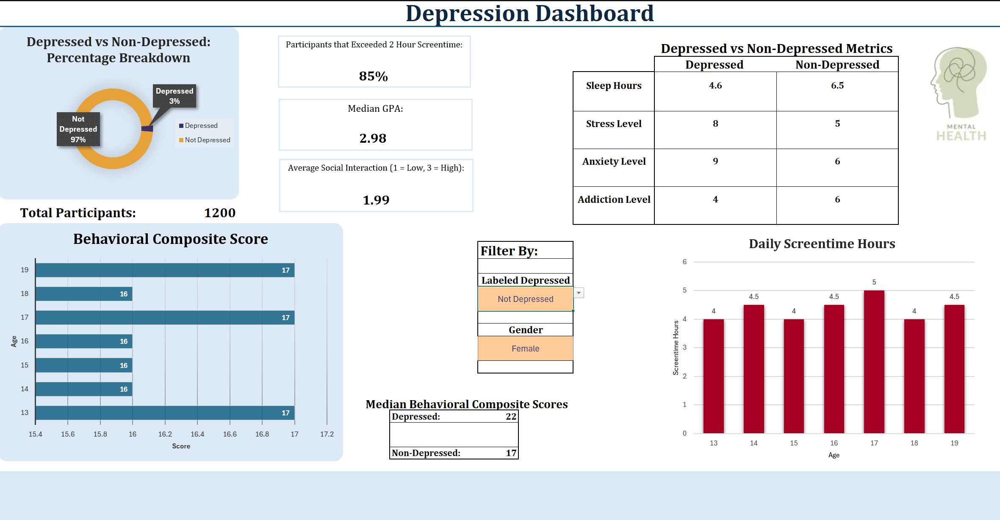
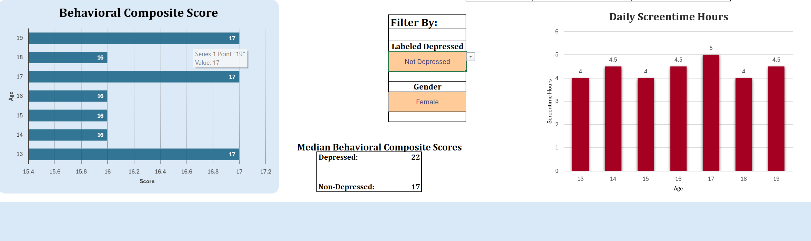
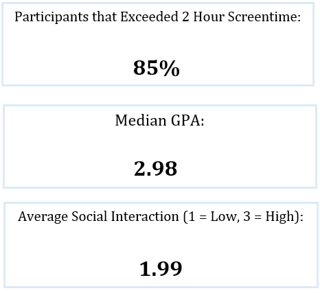

## Excel Depression Dashboard
* A portfolio project showcasing interactive dashboard design, KPI cards, and analytical Excel techniques*

### Project Overview

This project demonstrates my ability to design an interactive dashboard using synthetic teen mental-health data. The dashboard highlights behavioral differences between participants labeled depressed and non-depressed using dynamic visuals, slicers, and KPI cards.

The goal of this project is to showcase: 
- Proficient dashboard-building skills
- Interactive slicer-based user input
- Custom KPI cards built manually using formula, shapes, and conditional formatting
- Clean data modeling and formula logic (eg. MEDIANIFS, COUNTIFS, dynamic ranges)

This project is intentionally built in Excel to demonstrate proficiency in Excel-based BI work.

### Dataset
The dataset is fully synthetic and includes variables such as:
- Age & Gender
- Daily Screentime
- Sleep Hours
- Academic Performance
- Stress, Anxiety, and Addiction Levels
- Depression Label
- Social Interaction Level
- Social Media Platform

### Dashboard Features
Interactive Slicers
- Depression
- Gender
These slicers allow users to explore the differences between depressed and non-depressed individuals by gender.

Dynamic Charts
- Daily Screentime Hours
- Behavioral Composite Scores
The charts update instantly based on slicer selections.

Custom KPI Cards
- Displaying the percentage of participants that exceeded 2 hours of screentime
- Median GPAs
- Average social interaction
These KPIs update instantly based on the slicer selections.

### Technical Highlights

Formula Techniques:
- MEDIANIFS\
  Used to compute key metrics such as GPA and screentime. Median was preferred over average due to class imbalance between depressed and non-depressed participants, reducing the impact of outliers.
- Defined Names\
  Used for cleaner references and easier dashboard finalization.
- COUNTIFS\
  Used frequently to evaluate how many participants met specific conditions, identify class imbalance, and validate conditional logic (sanity checks). Also used to build the depression status percentage chart. 
- SWITCH\
  Used to convert binary depression labels (0/1) into "Not Depressed" and "Depressed" for stakeholder readibility. Also used to standardize gender labels from lowercase ("male, "female") to capitalized ("Male", "Female").

Summary of Key Metric Calculations:
- Behavioral Composite\
  Sums stress, anxiety, and addiction levels to create simple behavioral indicator
- Median GPA\
  Calculated using MEDIANIFS, filtered dynamically based on slicer selections.
- Screentime KPI\
  Uses COUNTIFS to calculate the percentage of participants with more than 2 hours of daily screentime.
The 2-hour threshold was chosen based on Digital Media Use and Screen Time Exposure Among Youths: A Lifestyle-Based Public Health Concern authored by Khanani et al., and published by the National Library of Medicine.
https://pmc.ncbi.nlm.nih.gov/articles/PMC12364383/

Dashboard Design:
- Simple, consistent color palette
- Clean spacing and navigatable layout
- KPI section placed at the top for quick insights
- Slicer panel with clearly highlighted interactive cells

Interactivity:
- Charts and KPI cards respond instantly to slicer changes
- Workbook protection ensures users can only interact with slicers, keeping navigation straightforward

### How to Access
1. Download the Excel File named *Depression_Dashboard.xlxs* under the *Dashboard* Folder
2. Enable editing
3. Use slicers to explore the differences betwen depressed and non-depressed participants by their gender
4. Review the charts and KPI charts for insights
5. Look at the table for general differences between depressed and non-depressed independent of gender

